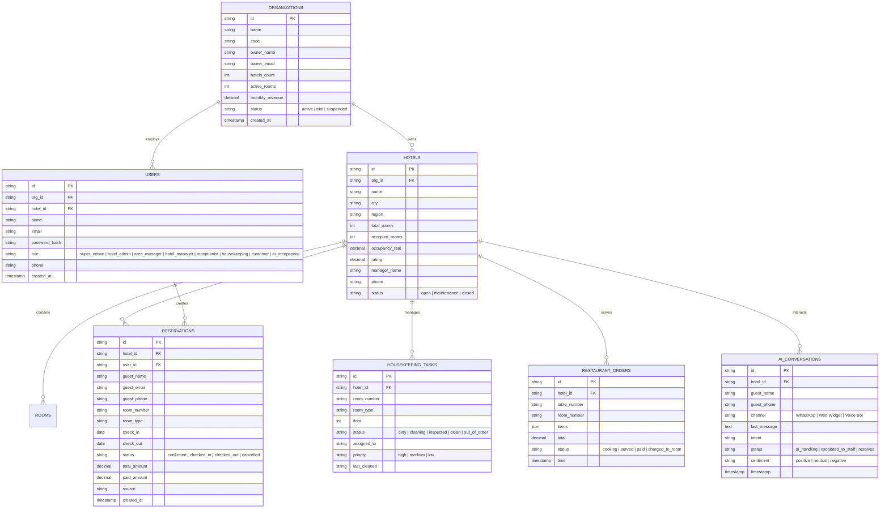

# 📖 LuckNexa — Hotel Operating System Backend API Specification & Contract

This document provides the complete technical specification for backend developers integrating with the LuckNexa frontend.

---

## 🏗️ 1. System Overview & Architecture

- **Frontend Base URL**: `http://localhost:3000`
- **Backend API Base URL**: `http://localhost:5000/api`
- **Authentication**: JWT Bearer Token in HTTP Header `Authorization: Bearer <token>`
- **Content Type**: `application/json`

---

## 🗄️ 2. Recommended Database Schema (ERD)



---

## 📡 3. REST API Endpoints Specification

### 3.1 Authentication & User Management

#### `POST /api/auth/login`

- **Description**: Authenticates user and returns JWT token.
- **Request Body**:

```json
{
  "email": "admin@meridianhotels.com",
  "password": "••••••••",
  "role": "super_admin"
}
```

- **Response `200 OK`**:

```json
{
  "success": true,
  "message": "Login successful",
  "token": "eyJhbGciOiJIUzI1NiIsInR5cCI6IkpXVCJ9...",
  "user": {
    "id": "usr-sa-01",
    "name": "Alexander Whitfield",
    "email": "admin@meridianhotels.com",
    "role": "super_admin",
    "orgId": "org-1",
    "orgName": "Meridian Hotel Group"
  },
  "expiresIn": 604800
}
```

#### `POST /api/auth/register`

- **Description**: Registers a new hotel organization and creates initial Hotel Admin user.
- **Request Body**:

```json
{
  "orgName": "Meridian Hotel Group",
  "orgCode": "MERIDIAN",
  "adminName": "Alexander Whitfield",
  "email": "admin@meridianhotels.com",
  "phone": "+1 555 0192",
  "password": "Password123!"
}
```

- **Response `201 Created`**:

```json
{
  "success": true,
  "message": "Organization registered successfully",
  "token": "eyJhbGciOiJIUzI1NiIsIn...",
  "user": {
    "id": "usr-ha-01",
    "name": "Alexander Whitfield",
    "email": "admin@meridianhotels.com",
    "role": "hotel_admin",
    "orgId": "org-meridian",
    "orgName": "Meridian Hotel Group"
  }
}
```

#### `GET /api/auth/me`

- **Headers**: `Authorization: Bearer <token>`
- **Response `200 OK`**:

```json
{
  "success": true,
  "user": {
    "id": "usr-sa-01",
    "name": "Alexander Whitfield",
    "email": "admin@meridianhotels.com",
    "role": "super_admin",
    "orgId": "org-1",
    "orgName": "Meridian Hotel Group"
  }
}
```

---

### 3.2 Organizations (Super Admin)

#### `GET /api/organizations`

- **Headers**: `Authorization: Bearer <token>`
- **Response `200 OK`**:

```json
{
  "success": true,
  "count": 3,
  "data": [
    {
      "id": "org-1",
      "name": "Meridian Hotel Group",
      "code": "MERIDIAN",
      "ownerName": "A. Whitfield",
      "ownerEmail": "a.whitfield@meridianhotels.com",
      "hotelsCount": 6,
      "activeRooms": 480,
      "monthlyRevenue": 3420000,
      "status": "active",
      "createdAt": "2024-01-15"
    }
  ]
}
```

#### `POST /api/organizations`

- **Headers**: `Authorization: Bearer <token>`
- **Request Body**:

```json
{
  "name": "Royal Heritage Resorts",
  "code": "ROYAL",
  "ownerName": "Rajiv Singhania",
  "ownerEmail": "rajiv@royal.com",
  "hotelsCount": 4,
  "activeRooms": 320,
  "monthlyRevenue": 2750000
}
```

---

### 3.3 Hotels (Hotel Admin, Area Manager)

#### `GET /api/hotels`

- **Query Params**: `?orgId=org-1&region=West%20Zone`
- **Response `200 OK`**:

```json
{
  "success": true,
  "count": 4,
  "data": [
    {
      "id": "hotel-101",
      "orgId": "org-1",
      "name": "Meridian Grand Palace",
      "city": "Mumbai",
      "region": "West Zone",
      "totalRooms": 120,
      "occupiedRooms": 104,
      "occupancyRate": 86.6,
      "rating": 4.8,
      "managerName": "Vikram Malhotra",
      "phone": "+91 98201 12345",
      "status": "open"
    }
  ]
}
```

#### `POST /api/hotels`

- **Headers**: `Authorization: Bearer <token>`
- **Request Body**:

```json
{
  "name": "Meridian Skyline",
  "city": "New Delhi",
  "region": "North Zone",
  "totalRooms": 150,
  "managerName": "K. Mehra",
  "phone": "+91 98111 00000"
}
```

---

### 3.4 Reservations & Front Desk (Hotel Operations)

#### `GET /api/reservations`

- **Query Params**: `?status=confirmed&hotelName=Meridian%20Grand%20Palace`
- **Response `200 OK`**:

```json
{
  "success": true,
  "count": 4,
  "data": [
    {
      "id": "RES-8821",
      "guestName": "Arjun Verma",
      "guestEmail": "arjun.verma@example.com",
      "guestPhone": "+91 98111 22334",
      "hotelName": "Meridian Grand Palace",
      "roomNumber": "402",
      "roomType": "Executive Suite",
      "checkIn": "2026-08-24",
      "checkOut": "2026-08-27",
      "status": "checked_in",
      "totalAmount": 38500,
      "paidAmount": 38500,
      "source": "Web Direct"
    }
  ]
}
```

#### `PATCH /api/reservations/:id/status`

- **Request Body**:

```json
{
  "status": "checked_in"
}
```

---

### 3.5 Housekeeping (Hotel Operations)

#### `GET /api/housekeeping`

- **Query Params**: `?floor=2&status=dirty`
- **Response `200 OK`**:

```json
{
  "success": true,
  "data": [
    {
      "id": "HK-101",
      "roomNumber": "104",
      "roomType": "Standard Twin",
      "floor": 1,
      "status": "dirty",
      "assignedTo": "Kavita Devi",
      "priority": "high",
      "lastCleaned": "Yesterday 11:30 AM"
    }
  ]
}
```

#### `PATCH /api/housekeeping/:id/status`

- **Request Body**:

```json
{
  "status": "cleaning",
  "assignedTo": "Manoj Kumar"
}
```

---

### 3.6 Restaurant POS (Hotel Operations)

#### `GET /api/pos/orders`

- **Response `200 OK`**:

```json
{
  "success": true,
  "data": [
    {
      "id": "POS-409",
      "tableNumber": "T-04 (Poolside)",
      "roomNumber": "402",
      "items": ["Grilled Salmon with Asparagus", "Virgin Mojito x2", "Tiramisu"],
      "total": 3450,
      "status": "cooking",
      "time": "12:10 PM"
    }
  ]
}
```

#### `POST /api/pos/orders`

- **Request Body**:

```json
{
  "tableNumber": "T-05",
  "roomNumber": "305",
  "items": ["Caesar Salad", "Club Sandwich"],
  "total": 1450,
  "status": "cooking"
}
```

---

### 3.7 AI Receptionist & Guest Concierge

#### `GET /api/ai/conversations`

- **Response `200 OK`**:

```json
{
  "success": true,
  "data": [
    {
      "id": "AI-901",
      "guestName": "Arjun Verma (Room 402)",
      "guestPhone": "+91 98111 22334",
      "channel": "WhatsApp",
      "lastMessage": "Can you send 2 extra bath towels and a dental kit to room 402?",
      "intent": "Room Service",
      "status": "ai_handling",
      "sentiment": "positive",
      "timestamp": "12:12 PM"
    }
  ]
}
```

#### `POST /api/ai/conversations/:id/messages`

- **Request Body**:

```json
{
  "message": "Extra towels requested for Room 402"
}
```

---

### 3.8 Invoices, Billing & Revenue Transactions (Hotel Admin & Operations)

#### `GET /api/invoices`

- **Headers**: `Authorization: Bearer <token>`
- **Query Params**:
  - `orgId` *(string, optional)*: Filter by hotel organization
  - `hotelId` *(string, optional)*: Filter by property
  - `status` *(string, optional)*: `paid` | `pending` | `overdue` | `all`
  - `billedBy` *(string, optional)*: Filter by issuing staff member
  - `search` *(string, optional)*: Text search across guest name, invoice ID, room number, staff, or property
- **Response `200 OK`**:

```json
{
  "success": true,
  "count": 4,
  "metrics": {
    "totalInvoiced": 9500,
    "totalPaid": 8500,
    "totalPending": 0,
    "totalOverdue": 1000
  },
  "data": [
    {
      "id": "INV-8960",
      "guest": "jhgf",
      "room": "203",
      "amount": 1000,
      "status": "overdue",
      "date": "Sep 5, 2026",
      "hotelId": "hotel-1788547097892",
      "hotelName": "Regal 77",
      "paymentMethod": "Pending",
      "orgId": "org-987123-1788542768377",
      "billedBy": "Aviral yadav",
      "billedByRole": "receptionist"
    }
  ]
}
```

#### `POST /api/invoices`

- **Headers**: `Authorization: Bearer <token>`
- **Request Body**:

```json
{
  "guest": "Rahul Sharma",
  "room": "101",
  "amount": 3500,
  "status": "pending",
  "paymentMethod": "Pending",
  "hotelId": "hotel-1788547097892",
  "hotelName": "Regal 77",
  "orgId": "org-987123-1788542768377",
  "billedBy": "Aviral yadav",
  "billedByRole": "receptionist"
}
```

- **Validation**:
  - `room` must exist in the property room inventory (`Room` collection).
  - When `status` is `paid`, `paymentMethod` specifies the settlement method (`UPI / Digital`, `Credit Card`, `Cash`, `Room Charge`, `Bank Transfer`).
  - When `status` is `pending` or `overdue`, `paymentMethod` defaults to `Pending`.

#### `PATCH /api/invoices/:id/pay`

- **Headers**: `Authorization: Bearer <token>`
- **Request Body**:

```json
{
  "paymentMethod": "UPI / Digital"
}
```

- **Response `200 OK`**:

```json
{
  "success": true,
  "message": "Invoice marked as paid & payment settlement recorded.",
  "data": {
    "id": "INV-8960",
    "status": "paid",
    "paymentMethod": "UPI / Digital",
    "transactionRef": "TXN-SETTLE-1788561092680",
    "paidAt": "2026-09-05T04:21:25.210Z"
  }
}
```
